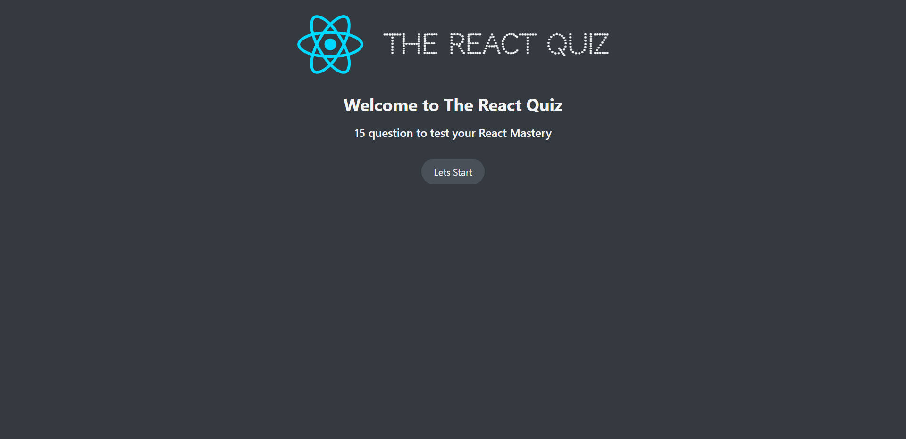
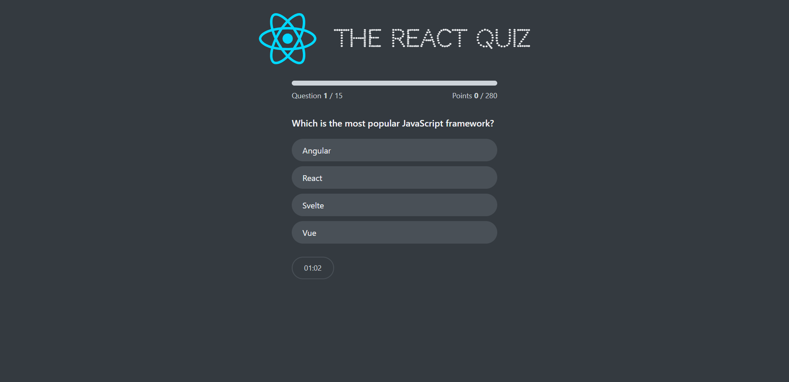
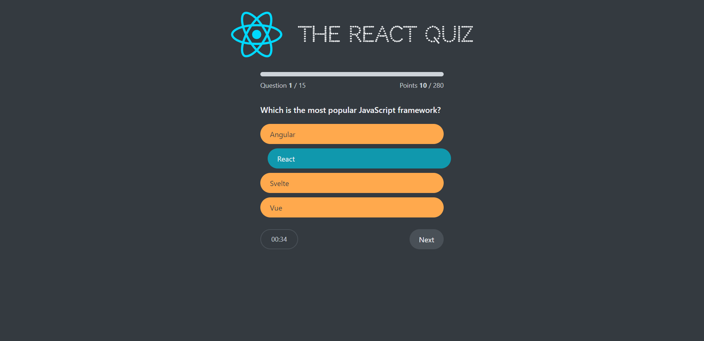
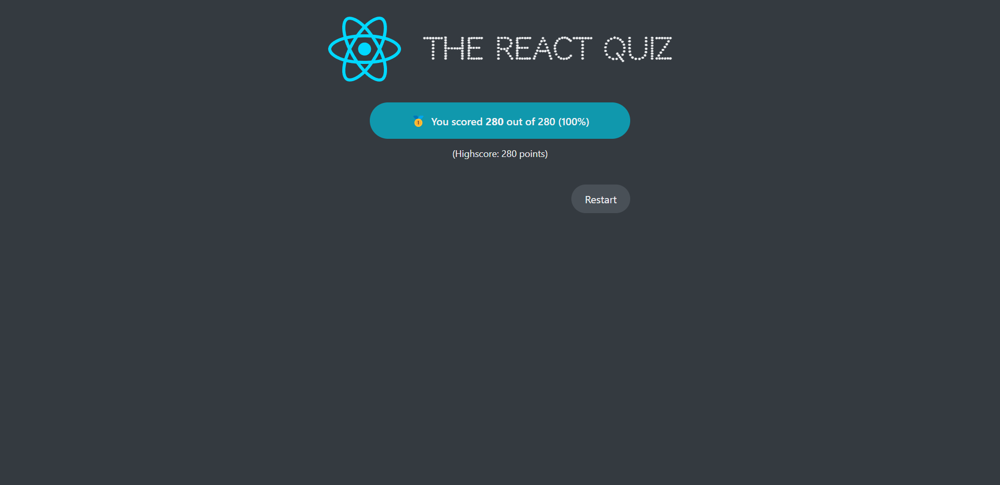

 # ✨ Project Title: The React Quiz

 ## 📽️ Overview
 The React Quiz is a lightweight React application designed to facilitate learning and exploration of the useReducer hook for state management. This front-end quiz app employs a minimalistic approach, utilizing a JSON file for question data and simulating a server using the json-server library.

## ✨ Key Learning 

In developing The React Quiz project, the primary focus was on leveraging the useReducer hook for state management in React. This key learning can be summarized as follows:

- State Simplification: The useReducer hook provided a structured and efficient approach to managing state in a React application. It allowed for a more organized and centralized handling of state changes, streamlining the overall development process.

- Code Readability: By using useReducer, the code became more readable and maintainable. Actions and reducers encapsulated logic related to state changes, enhancing code comprehension and making it easier to trace and understand the flow of data.

- Predictable State Transitions: useReducer facilitated a predictable and controlled way of handling state transitions. This predictability is essential for debugging and ensuring that the application behaves as expected during various user interactions.

- Consistent Application Logic: With useReducer, the logic for state transitions remained consistent and cohesive. This uniformity in handling state changes across components contributed to a more robust and reliable application.

- Enhanced Scalability: As the project evolved, the use of useReducer provided a scalable foundation for managing more complex state requirements. It allowed for the addition of new features or modifications with minimal impact on existing code.

By employing the useReducer hook in The React Quiz, developers gained valuable insights into effective state management practices in React, contributing to a deeper understanding of how to build scalable and maintainable applications.

 ## 🚀 Getting Started

**1.** Clone the repository using the following command:

    git clone git@github.com:McACE007/The-React-Quiz.git

**2.** Install the required dependencies by running the following command in your terminal:

    npm install

**3.** Start the development server by running the following command:

    npm run dev

**4.** When you are ready to deploy, simply run the following command to create a production-ready build:

    npm run build  

Embark on a React adventure with The React Quiz! 🚀 Explore the [live demo](https://the-react-quiz-rust.vercel.app/) for a simple and engaging quiz experience. Whether you're a React learner or a seasoned developer, this app introduces you to the useReducer hook in a user-friendly way.

## 📸 Screenshots

| Start Page | Quiz Page |
|------|-------|
|||

| Quiz Page Page with Option Selected  | Finish Page |
|------|-------|
|||
